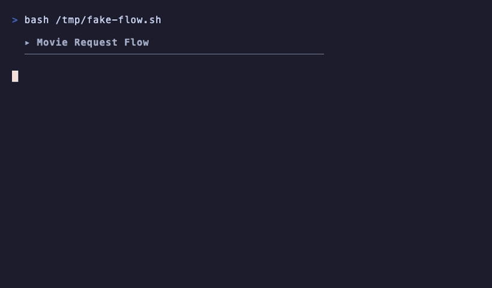

<div align="center">
  <br>
  <a href="#one-command-install">
    
  </a>
  <br><br>
  <strong>Self-hosted media server for macOS</strong>
  <br>
  <sub>Automatically find, download, and organize movies and TV shows.<br>Browse a Netflix-like interface, click what you want, and it handles the rest.</sub>
  <br><br>
  
  
  
  
  
  
  
  
  <br><br>
  
  
  <br><br>
</div>

## Why This One?

There are dozens of *arr stack Docker Compose repos on GitHub. Almost all of them dump a compose file and leave you to figure out the rest. This one is different:

- **One command to install.** Clone, configure, and start everything with a single `curl | bash`. No 45-minute manual setup.
- **Auto-configures itself.** The configure script wires up Radarr, Sonarr, Prowlarr, Seerr, and qBittorrent via their APIs. No clicking through 6 different web UIs.
- **Built for macOS.** Native paths, launchd instead of systemd, OrbStack or Docker Desktop instead of bare Docker. Not a Linux guide with "should work on Mac" in the footnotes.
- **Self-healing.** Hourly health checks restart anything that goes down. VPN drops, container crashes, stalled downloads — handled automatically.

---

## What's Included

| Service | What It Does |
|---------|-------------|
| **Seerr** | Netflix-style UI for browsing and requesting movies/shows |
| **Plex** | Plays your media on any device (TV, phone, laptop) |
| **Jellyfin** | Open-source alternative to Plex (opt-in via `--jellyfin` flag) |
| **Radarr** | Automatically finds and downloads movies |
| **Sonarr** | Automatically finds and downloads TV shows |
| **Prowlarr** | Manages search indexers for Radarr/Sonarr |
| **qBittorrent** | Downloads torrents through a VPN tunnel |
| **Gluetun** | VPN container (ProtonVPN or PIA) so downloads are private |
| **Bazarr** | Auto-fetches subtitles |
| **FlareSolverr** | Bypasses Cloudflare protection on certain indexers |
| **Watchtower** | Optional auto-updater (opt-in profile) |

## Requirements

- macOS (any recent version)
- [OrbStack](https://orbstack.dev) (recommended) or [Docker Desktop](https://www.docker.com/products/docker-desktop/)
- A Plex account (free) or Jellyfin (no account needed)
- VPN credentials (ProtonVPN or PIA)

> **Why OrbStack?** It starts in ~2 seconds (vs 30s for Docker Desktop), uses ~1GB RAM (vs 4GB), and has 2-10x faster file I/O. It's a drop-in replacement that runs the same Docker commands. Docker Desktop works fine too.

## One-Command Install

Requires OrbStack (or Docker Desktop) and Plex already installed. Handles everything else.

```bash
curl -fsSL https://raw.githubusercontent.com/liamvibecodes/mac-media-stack/main/bootstrap.sh | bash
```

Optional flags when running from a local clone:

```bash
bash bootstrap.sh --media-dir /Volumes/T9/Media --install-dir ~/mac-media-stack --non-interactive
bash bootstrap.sh --jellyfin  # use Jellyfin instead of Plex
bash bootstrap.sh --pia       # use PIA instead of ProtonVPN
```

## Update Existing Clone

Already cloned an older version and want the latest release tag without reinstalling?

One-liner (run inside your existing clone directory):

```bash
bash <(curl -fsSL https://raw.githubusercontent.com/liamvibecodes/mac-media-stack/main/scripts/update-to-latest-release.sh)
```

Local script (once present):

```bash
bash scripts/update-to-latest-release.sh
```

<details>
<summary>See it in action</summary>
<br>

</details>

### Choosing Your Media Server

**Plex** (default) runs natively on macOS. Polished apps, easy remote streaming, free Plex account required.

**Jellyfin** is fully open source with no account needed. Add `--jellyfin` to the bootstrap command or set `MEDIA_SERVER=jellyfin` in `.env`. It runs as a Docker container alongside everything else.

## Manual Quick Start

If you prefer to run each step yourself:

```bash
git clone https://github.com/liamvibecodes/mac-media-stack.git
cd mac-media-stack
bash scripts/setup.sh        # creates folders, generates .env
# edit .env and add your VPN keys
bash scripts/doctor.sh       # preflight validation before first boot
docker compose up -d         # start everything
# if MEDIA_SERVER=jellyfin in .env:
docker compose --profile jellyfin up -d
docker compose --profile autoupdate up -d watchtower  # optional auto-updates
bash scripts/configure.sh     # auto-configure all services
```

## Full Setup Guide

See [SETUP.md](SETUP.md) for the complete step-by-step walkthrough.
Pinned digest matrix: [IMAGE_LOCK.md](IMAGE_LOCK.md)

By default, Seerr is bound to `127.0.0.1` for safer local-only access. Set `SEERR_BIND_IP=0.0.0.0` in `.env` only if you intentionally want LAN exposure.

## Scripts

| Script | Purpose |
|--------|---------|
| `scripts/setup.sh` | Creates folder structure and .env file |
| `scripts/doctor.sh` | Runs preflight checks (runtime, env, compose, ports) |
| `scripts/configure.sh` | Auto-configures all service connections |
| `scripts/health-check.sh` | Checks if everything is running correctly |
| `scripts/auto-heal.sh` | Hourly self-healer (restarts VPN/containers if down) |
| `scripts/install-auto-heal.sh` | Installs auto-heal as a background job via launchd |
| `scripts/update-to-latest-release.sh` | Updates an older clone to the latest tagged release safely |
| `scripts/refresh-image-lock.sh` | Refreshes pinned image digests and regenerates IMAGE_LOCK.md |

## What It Looks Like


## Day-to-Day Usage

| What | Where |
|------|-------|
| Browse and request movies/shows | http://localhost:5055 |
| Watch your media (Plex) | http://localhost:32400/web |
| Watch your media (Jellyfin) | http://localhost:8096 |

Everything else is automatic. Requests get searched, downloaded, imported, and subtitled without any manual steps.

## How It Works



```
You (Seerr) -> Radarr/Sonarr -> Prowlarr (search) -> qBittorrent (download via VPN) -> Plex (watch)
                                                        Bazarr (subtitles) ^
```

All services run as Docker containers. Plex runs natively on macOS (or Jellyfin runs in Docker if selected). Download traffic routes through your VPN provider (ProtonVPN or PIA). Everything else uses your normal internet connection.

## Looking for More?

Check out [mac-media-stack-advanced](https://github.com/liamvibecodes/mac-media-stack-advanced) for the full power-user setup with transcoding (Tdarr), TRaSH quality profiles (Recyclarr), Plex metadata automation (Kometa), download watchdog, VPN failover, automated backups, and optional music management (Lidarr + Tidarr for Hi-Res FLAC from Tidal).
Already running basic and want to migrate? Follow the upgrade guide: [mac-media-stack-advanced/UPGRADE.md](https://github.com/liamvibecodes/mac-media-stack-advanced/blob/main/UPGRADE.md).

## Companion Tools

| Tool | What It Does |
|------|-------------|
| [mac-media-stack-permissions](https://github.com/liamvibecodes/mac-media-stack-permissions) | Audit and fix file permissions across your stack |
| [mac-media-stack-backup](https://github.com/liamvibecodes/mac-media-stack-backup) | Automated backup and restore for configs and databases |

## Author

Built by [@liamvibecodes](https://github.com/liamvibecodes)

## License

[MIT](LICENSE)
